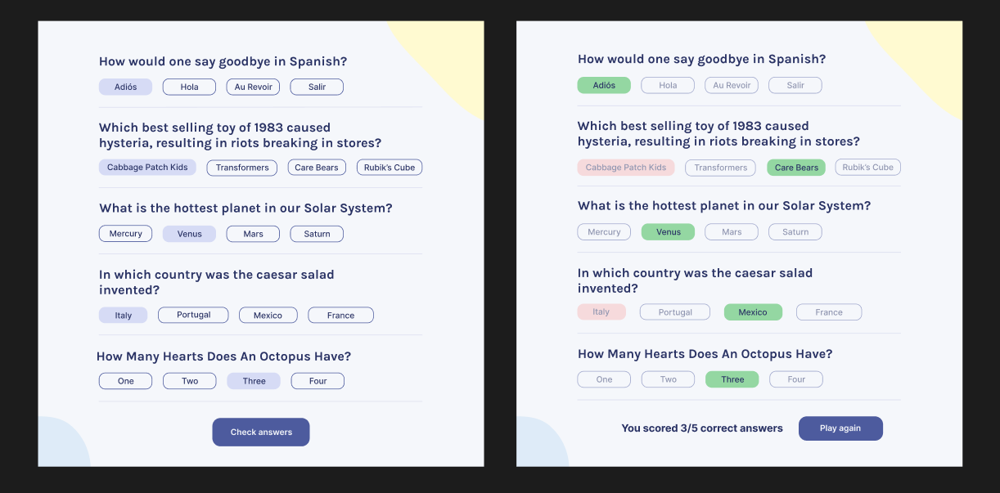

Quizzical

This is an interactive web application built using React, designed to dynamically display quiz questions and results based on user actions and progress. Leveraging React's powerful features such as conditional rendering and state management, the application provides a seamless and engaging quiz experience. The state-driven approach ensures real-time updates to the quiz interface, tracking user selections and progress while displaying tailored results. This project serves as a practical example of React's ability to create dynamic, responsive, and user-focused applications. Ideal for anyone looking to explore or enhance their skills in modern front-end development!

